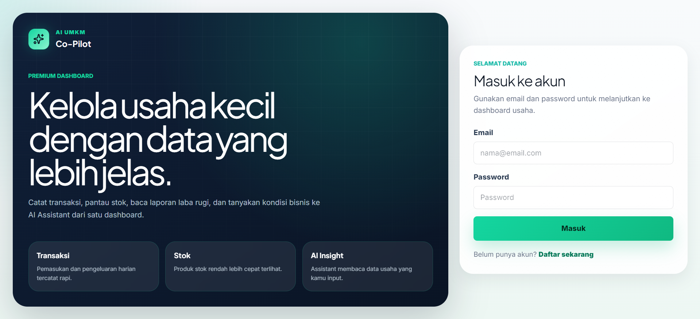
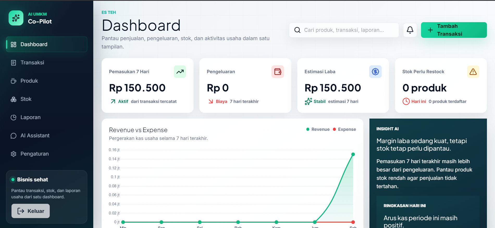
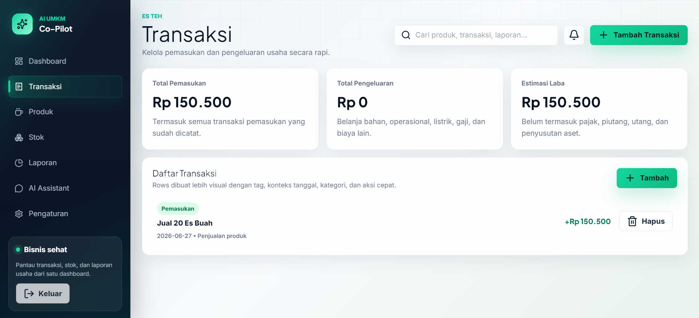
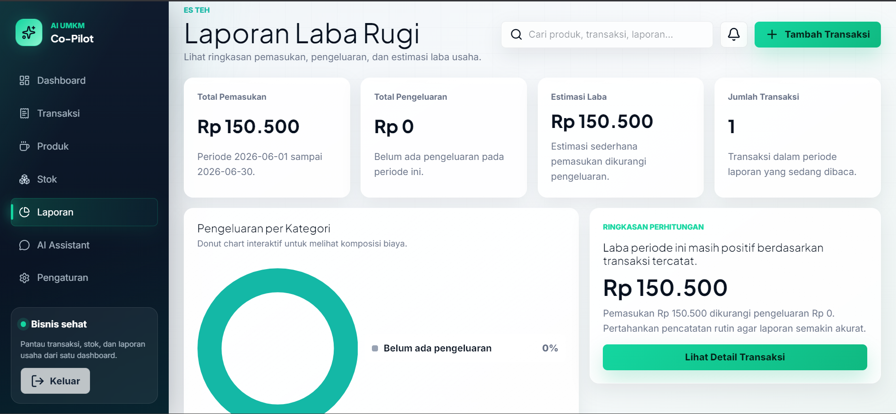
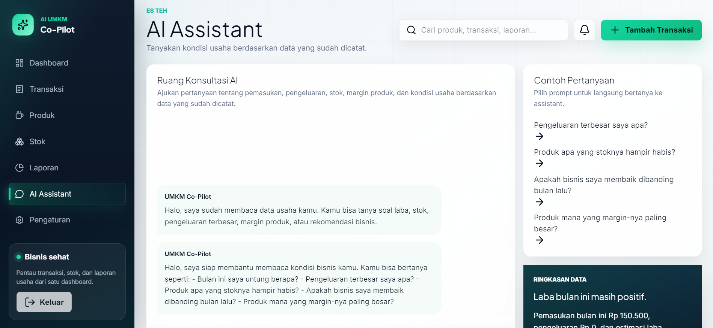
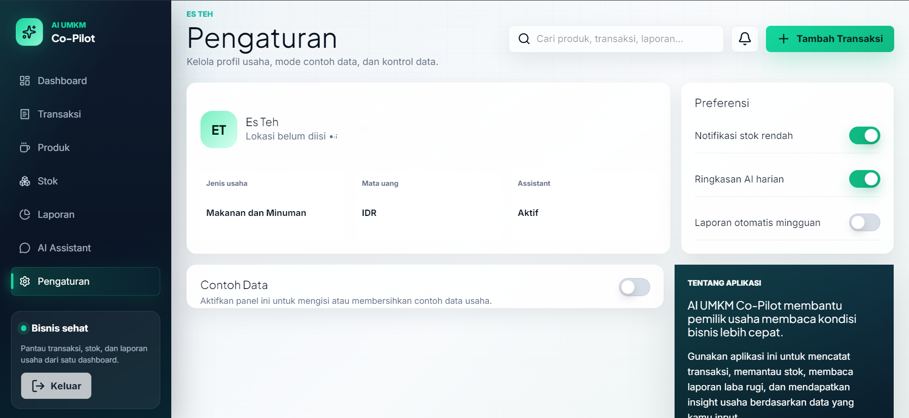

# AI UMKM Co-Pilot

AI UMKM Co-Pilot adalah aplikasi web untuk membantu pelaku UMKM mencatat transaksi, mengelola produk dan stok, membaca laporan laba rugi, serta memahami kondisi usaha melalui assistant berbasis data.

Aplikasi ini dirancang untuk pemilik usaha kecil yang membutuhkan dashboard sederhana, cepat, dan mudah dipakai tanpa harus menggunakan spreadsheet yang rumit.

## Live Demo

Production: `https://ai-umkm-copilot.vercel.app`

## Highlights

- Dashboard ringkasan penjualan, pengeluaran, laba, stok rendah, dan aktivitas terbaru.
- Manajemen transaksi pemasukan dan pengeluaran.
- Manajemen produk, harga modal, harga jual, margin, dan stok minimum.
- Pencatatan stok masuk dan stok keluar.
- Laporan laba rugi dengan visualisasi kategori pengeluaran.
- Assistant berbasis data untuk menjawab pertanyaan seputar usaha.
- Contoh data untuk mencoba aplikasi dengan cepat.
- Kontrol data: bersihkan contoh data atau hapus seluruh data usaha dengan verifikasi password.
- UI premium dengan responsive foundation, route loading indicator, animated counter, dan GSAP hover interaction.

## Screenshots

| Register | Dashboard |
|---|---|
|  |  |

| Transactions | Reports |
|---|---|
|  |  |

| Assistant | Settings |
|---|---|
|  |  |

## Tech Stack

- Next.js
- TypeScript
- Tailwind CSS
- Supabase Auth
- Supabase PostgreSQL
- Supabase Row Level Security
- Chart.js
- GSAP
- Lucide React
- Vercel

## Main Features

### Authentication

User dapat membuat akun, login, logout, dan mengakses data berdasarkan akun masing-masing.

### Business Profile

Setiap user membuat profil usaha sebelum masuk ke dashboard. Profil usaha menjadi pusat relasi untuk transaksi, produk, stok, laporan, dan assistant.

### Transactions

User dapat mencatat pemasukan dan pengeluaran usaha dengan kategori, nominal, tanggal, dan deskripsi.

### Products and Stock

User dapat mengelola produk, harga modal, harga jual, stok saat ini, stok minimum, serta riwayat stok masuk dan keluar.

### Reports

Aplikasi menampilkan laporan laba rugi berdasarkan transaksi yang sudah dicatat, termasuk ringkasan pemasukan, pengeluaran, estimasi laba, dan kategori pengeluaran terbesar.

### AI Assistant MVP

Assistant membaca data transaksi, produk, stok, dan laporan untuk memberikan jawaban berbasis rule-based logic. Fokusnya adalah membantu pemilik usaha memahami kondisi bisnis dengan bahasa sehari-hari.

Contoh pertanyaan:

- "Bulan ini saya untung berapa?"
- "Pengeluaran terbesar saya apa?"
- "Produk apa yang stoknya hampir habis?"
- "Produk mana yang margin-nya paling besar?"

## Project Structure

```txt
src/
  app/
    (auth)/
    (app)/
  components/
    charts/
    layout/
    settings/
    ui/
  lib/
    actions/
    services/
    supabase/
    utils/
  types/

supabase/
  schema.sql

docs/
  SETUP.md
  DATABASE.md
  ROADMAP.md
  RELEASE_NOTES.md